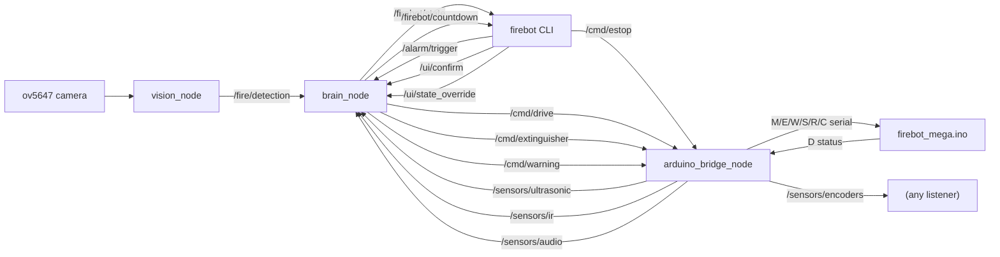
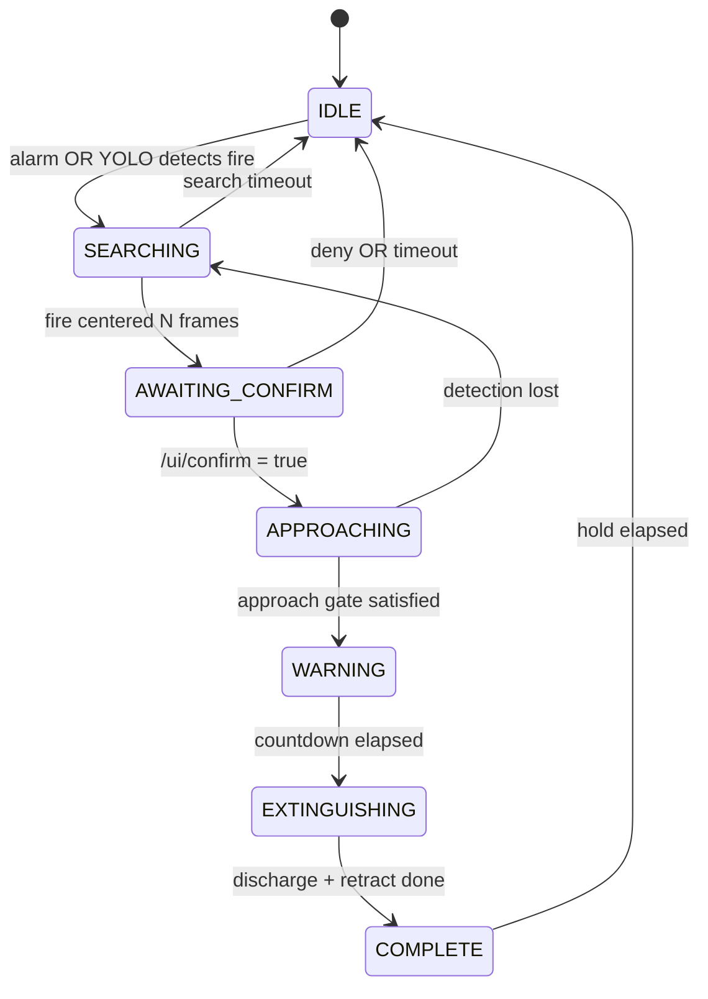

# Architecture

Three Python nodes, one Arduino firmware, one CLI.

For the runtime walkthrough (boot -> alarm -> approach -> extinguish),
see [INTEGRATION.md](INTEGRATION.md).

## Nodes and topics

| Node | Job | Hardware |
|---|---|---|
| [vision_node](../firebot_ws/src/firebot/firebot/vision_node.py) | camera + YOLO, publishes `/fire/detection` | ov5647 |
| [brain_node](../firebot_ws/src/firebot/firebot/brain_node.py) | 7-state supervisor, publishes drive / extinguisher / warning | none |
| [arduino_bridge_node](../firebot_ws/src/firebot/firebot/arduino_bridge_node.py) | serial to Mega, fans out to `/sensors/*` | `/dev/ttyACM0` |
| [firebot CLI](../firebot_ws/src/firebot/firebot/firebot_cli.py) | one-shot publishers for operator inputs | none |

## State machine

Approach gate by `approach_strategy`:

- `yolo_only` -- bbox area >= threshold.
- `yolo_ultrasonic` -- above AND HC-SR04 <= `approach_distance_cm`.
- `yolo_ultrasonic_ir` -- above AND KY-032 reports object.

`safety_stop_cm` preempts approach any time the ultrasonic reads at or
below it, regardless of the gate.

## Parameters

All tunables in
[config/firebot_params.yaml](../firebot_ws/src/firebot/config/firebot_params.yaml).
The bridge forwards `C,US|IR|MIC,0|1` at startup based on `enable_*`;
the brain reads `approach_strategy`. Change strategy without touching
code.

## Why three nodes

Vision is CPU-heavy and shouldn't share a process with the state
machine. The Mega owns every hard-realtime concern (PWM, step pulses,
solenoid timing), so the Pi doesn't need a motor node or extinguisher
node -- the bridge is a thin serial translator. The CLI is a console
script because operator inputs are infrequent.
