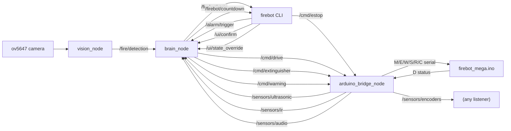
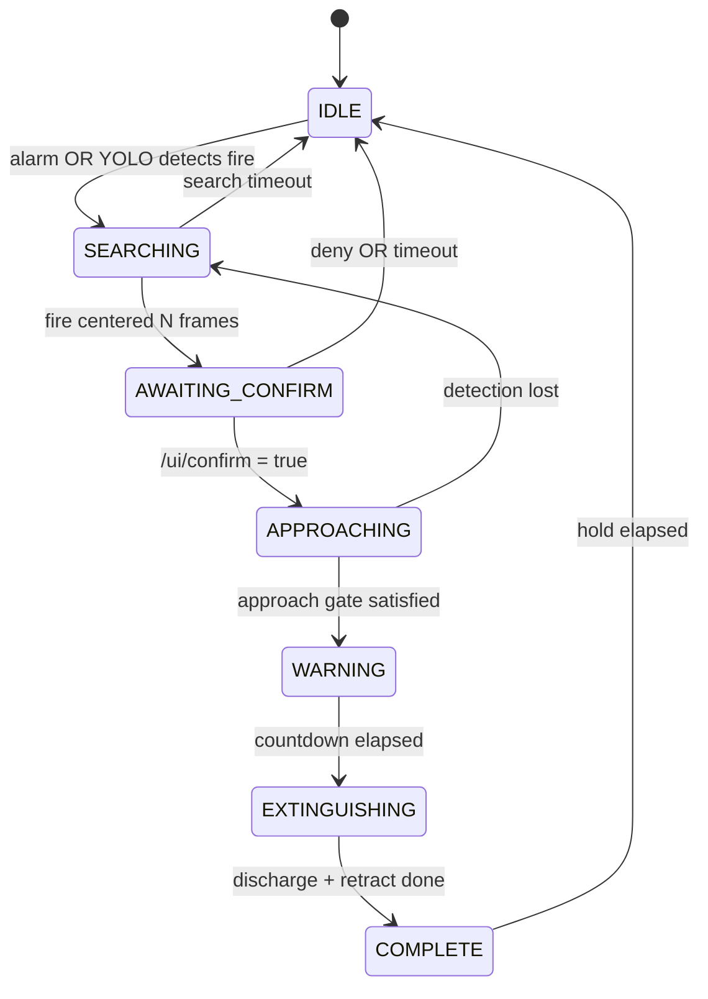

# FireBot696 Architecture

Three Python nodes + one Arduino firmware + one CLI. That is the whole system.

> For a step-by-step walkthrough of how these pieces behave on a live fire
> run (boot -> alarm -> approach -> extinguish), see
> [INTEGRATION.md](INTEGRATION.md).

## Nodes and topics

Node responsibilities:

| Node | Job | Uses hardware |
|---|---|---|
| [vision_node](../firebot_ws/src/firebot/firebot/vision_node.py) | camera capture + YOLO, publishes `/fire/detection` | Pi camera (ov5647) |
| [brain_node](../firebot_ws/src/firebot/firebot/brain_node.py) | 7-state supervisor, publishes drive / extinguisher / warning commands | none |
| [arduino_bridge_node](../firebot_ws/src/firebot/firebot/arduino_bridge_node.py) | serial to the Mega, fan-out to `/sensors/*` | `/dev/ttyACM0` |
| [firebot CLI](../firebot_ws/src/firebot/firebot/firebot_cli.py) | one-shot publishers for operator actions | none |

## State machine

Approach gate depends on the `approach_strategy` parameter:

- `yolo_only`: bbox area >= threshold
- `yolo_ultrasonic`: `yolo_only` AND HC-SR04 distance <= `approach_distance_cm`
- `yolo_ultrasonic_ir`: above AND KY-032 reports object

Within `APPROACHING`, a safety stop triggers whenever the ultrasonic reading
is at or below `safety_stop_cm` regardless of whether the approach gate is
satisfied yet.

## Parameters

All tunables live in [config/firebot_params.yaml](../firebot_ws/src/firebot/config/firebot_params.yaml).
Strategy and sensor enables can be flipped without touching code; the bridge
node forwards `C,US|IR|MIC,0|1` to the Mega at startup based on the `enable_*`
flags, and the brain node reads `approach_strategy` there.

## Why three nodes (not more)

Vision is CPU-heavy and should not share a process with the state machine.
The Mega owns every hard-realtime concern (PWM, step generation, solenoid
timing), so the Pi never needs a dedicated motor node or extinguisher node;
the bridge is a thin serial translator instead. The CLI is a console script,
not a long-running node, because operator inputs are infrequent.
