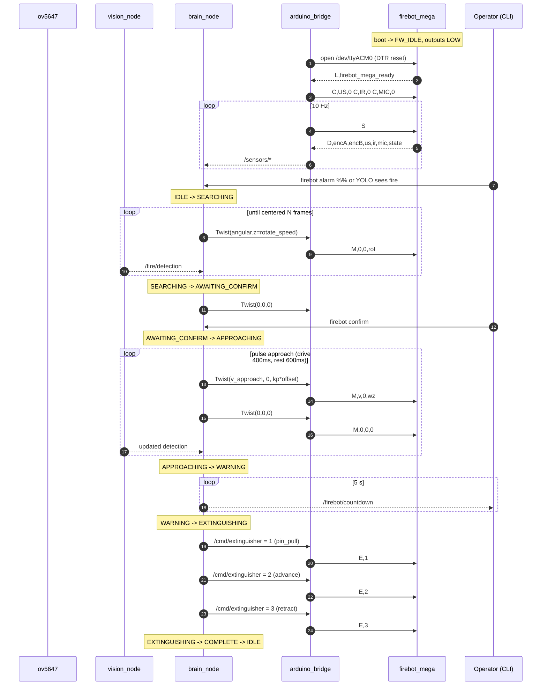

# Pi + Mega integration

## Physical connection

```
+-----------+    USB-A <-> USB-B     +----------------+
| Pi 5      |========================| Mega 2560 R3   |
|           | * +5 V from Pi (logic) |                |
|           | * USB-CDC @115200      |                |
|           | * DTR reset on open    |                |
+-----------+                        +----------------+
                                            |
                                            | motor / solenoid / stepper
                                            | power comes from the robot
                                            | battery per Fire_Bot.net
                                            v
                                [ DFR0601 x2, A4988, NMOS Q1, ... ]
```

One USB cable between Pi and Mega. The Pi powers the Mega's logic; the
robot battery powers everything that actually moves. Opening
`/dev/ttyACM0` toggles DTR, which resets the Mega -- `setup()` runs, all
outputs go LOW, and the Mega prints `L,firebot_mega_ready`.

## Two modes, same firmware

### Mode A: Mega alone

Pi is not plugged in. Power the Mega off USB, the barrel jack, or VIN.
Open the Serial Monitor at 115200 / Newline and use the commands in
[ARDUINO_TESTING.md](ARDUINO_TESTING.md). Firmware starts in `FW_IDLE`.
Short version:

```text
help            full menu
status          current state + sensors
forward 100     drive forward at PWM 100
stop            motors off
test motors     canned fwd/back/spin cycle
state searching mirror the Pi's SEARCHING behavior
estop           hard stop
```

Missing hardware is tolerated. Unwired outputs toggle into the void;
disabled sensors report `off` / `-1`.

### Mode B: Pi tethered

Plug the USB cable; the Mega resets. `arduino_bridge_node` opens
`/dev/ttyACM0`, waits 2 s for the boot banner, sends `C,US,0`
`C,IR,0` `C,MIC,0` (or whatever `enable_*` flags set), and polls `S`
at 10 Hz. `brain_node` starts `IDLE` and waits for an alarm, a CLI
confirm, or a YOLO detection.

While the Pi is running, the Mega is a slave -- Serial Monitor
commands still work but get overwritten on the next tick.

## End-to-end run



Step by step:

1. **Boot.** Bridge opens the port, Mega resets and prints
   `L,firebot_mega_ready`. Brain is `IDLE`.
2. **Trigger.** `firebot alarm`, or YOLO exceeds the detection
   threshold. Brain -> `SEARCHING`.
3. **Search.** Spin in place at `rotate_speed`. Each YOLO frame
   updates `x_offset`. When the fire stays inside
   `center_offset_thresh` for `stable_frames` ticks, stop and go to
   `AWAITING_CONFIRM`.
4. **Confirm.** `firebot confirm` (or `state approaching` on the Mega
   alone). Brain -> `APPROACHING`.
5. **Approach.** Pulsed drive: `approach_pulse_ms` on,
   `approach_rest_ms` off. The yaw P-controller re-centers every
   pulse. Exit on bbox-area gate + any sensor gates from
   `approach_strategy`. Hard cap at `approach_max_sec` so the robot
   never drives indefinitely.
6. **Warning.** 5 s countdown on `/firebot/countdown`.
7. **Extinguish.** `E,1` (pin), `E,2` (advance), `E,3` (retract). The
   Mega auto-stops each stepper phase.
8. **Complete.** `W,0` + `E,0`, hold for `complete_hold_sec`, return
   to `IDLE`.

State transitions show up in the ROS logs as `state: OLD -> NEW`;
pulse cycles print `approach pulse: drive` / `approach pulse: rest`.

## Indoor safety defaults

| Guardrail | Where | Default |
|---|---|---|
| Forward PWM | `brain_node.v_approach` | 60 |
| Rotation PWM | `brain_node.rotate_speed` | 55 |
| Pulse drive | `approach_pulse_ms` / `approach_rest_ms` | 400 / 600 ms |
| Approach timeout | `approach_max_sec` | 20 s |
| Pi -> Mega watchdog | firmware `PROTOCOL_DRIVE_WATCHDOG_MS` | 1000 ms |
| Canned-test fwd/back bursts | firmware `MOTOR_SEQ` | 500 ms |
| Test PWM | firmware `g_tseq_speed` | 100 |
| Ultrasonic safety stop (opt-in) | `brain_node.safety_stop_cm` with `yolo_ultrasonic` | 20 cm |

- **Pulse drive.** `APPROACHING` never drives continuously; the coast
  window is there so you have a chance to `firebot estop`, and it
  keeps `x_offset` jitter from slamming the robot into a wall.
- **Watchdog.** Applies only to Pi-side `M` commands with non-zero
  motion. Human `forward 100` from the Serial Monitor stays latched
  until you say `stop`.
- **Approach cap.** If the bbox gate never trips (dim fire, odd
  angle), the brain bails to `WARNING` at 20 s.

To hard-gate the approach on distance, flip `enable_ultrasonic: true`
in `firebot_params.yaml` and set `approach_strategy: yolo_ultrasonic`.

## Stopping the robot

- `firebot estop` -> `/cmd/estop` -> bridge sends `R`.
- `estop` or `reset` in the Mega Serial Monitor.
- Pull USB -- the Mega's Pi-side watchdog zeros motors within 1 s.

All three end up in `allOutputsOff()`; firmware goes to `FW_ESTOP`.
Any motion command (`stop`, `idle`, `M,0,0,0`) releases it.
