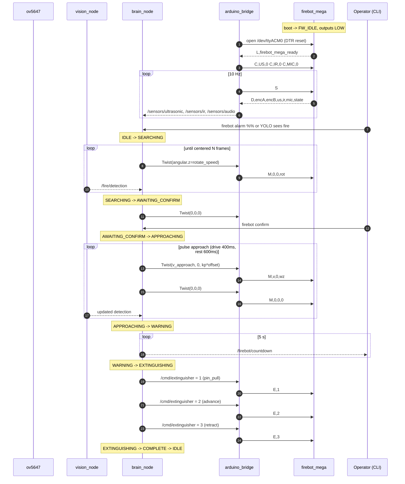

# Pi 5 + Arduino Mega Integration

This is the "how does the whole system actually fit together" page for
teammates. It covers:

1. How the Pi and the Mega are physically connected.
2. What each side does when the Mega is alone (no Pi) vs. when both are
   powered on and talking.
3. Exactly what happens, step by step, when you start the stack with the
   camera running.
4. The indoor-safety guardrails that keep the robot from hurting itself.

If you only want to poke the Mega by itself, skip to
[docs/ARDUINO_TESTING.md](ARDUINO_TESTING.md). If you want to understand
the state machine, keep reading.

## 1. Physical connection

```
+-----------+     USB-A  <-->  USB-B    +----------------+
| Raspberry |===========================| Arduino Mega   |
| Pi 5      |   * +5 V from Pi (logic)  | 2560 R3 Shield |
|           |   * USB-CDC serial @115200|                |
|           |   * DTR reset on open     |                |
+-----------+                           +----------------+
                                              |
                                              | (motor / solenoid / stepper power
                                              |  is NOT on this cable -- it comes
                                              |  from the main robot battery as
                                              |  wired in Fire_Bot.net)
                                              v
                                     [ DFR0601 x2, A4988, NMOS Q1, ... ]
```

- One USB cable. Nothing else is wired between the Pi and the Mega.
- The Pi's USB rail powers the Mega's logic (ATmega2560 + ATmega16U2).
  The Mega's motor drivers, stepper driver, solenoid, and sensors are
  still powered by the robot battery exactly like the schematic shows.
- Opening `/dev/ttyACM0` on the Pi toggles DTR, which hard-resets the
  Mega. The firmware's `setup()` runs, all outputs are pulled LOW, and
  the Mega prints `L,firebot_mega_ready` over the serial link.

## 2. Two supported operating modes

### Mode A -- Arduino alone (initial bring-up, what teammates will use most)

Everything is wired to the Mega as shown in `Fire_Bot.net`, but the Pi is
not plugged in.

- Power: USB-B from a laptop, or the barrel jack, or the robot battery via
  the shield's VIN pin -- any one is fine for logic.
- Control: open the Arduino IDE Serial Monitor at **115200 baud, line
  ending = Newline**, and type commands.
- The firmware starts in `FW_IDLE`. It prints a banner, then waits. The
  robot will not move until you tell it to.
- Full command reference: [docs/ARDUINO_TESTING.md](ARDUINO_TESTING.md).
  Short version:

  ```text
  help                     show every command
  status                   current state / sensors
  forward 100              drive forward at PWM 100
  stop                     all motors off
  test motors              canned fwd/back/spin cycle
  state searching          mirror the Pi's SEARCHING behavior
  estop                    hard stop everything
  ```

- The Mega happily tolerates missing hardware. If the solenoid is not
  wired, `pin on` still toggles D7 -- it just toggles into the void.
  Disabled sensors report `off` / `-1` so you can tell them apart from
  real zero readings.

### Mode B -- Pi tethered over USB (full stack)

The same firmware does both jobs; nothing changes when the Pi shows up.

1. Plug the USB cable from the Pi to the Mega (the Mega resets).
2. Power on the Pi and let the Docker container come up (see README).
3. `arduino_bridge_node` opens `/dev/ttyACM0`, waits 2 s for the reset
   banner, sends the initial sensor enables (`C,US,0`, `C,IR,0`,
   `C,MIC,0` by default), and starts polling `S` at 10 Hz.
4. `brain_node` starts in `IDLE` and waits for an alarm, a CLI confirm,
   or a YOLO fire detection from `vision_node`.

From the moment the container is up, the Mega is a pure slave: it runs
whatever the Pi tells it to and reports sensor status back. Human
commands in the Serial Monitor still work (useful for debugging), but
the Pi may overwrite them on the next tick.

## 3. End-to-end: what happens during a fire-fighting run

This is the sequence teammates should be able to follow while reading
the logs:



Phrased in plain English:

1. **Boot.** Pi starts the container; bridge opens the serial port; Mega
   auto-resets and prints `L,firebot_mega_ready`. Brain is `IDLE`.
2. **Trigger.** Someone runs `firebot alarm` (simulated bell) or the
   YOLO node detects fire with confidence over threshold. Brain moves
   to `SEARCHING`.
3. **Search.** Brain commands the Mega to spin in place (`rotate_speed`
   PWM). Each YOLO frame updates `x_offset`. When the fire is within
   `center_offset_thresh` for `stable_frames` ticks, brain stops and
   moves to `AWAITING_CONFIRM`.
4. **Human confirm.** Operator runs `firebot confirm` (or types `state
   approaching` on the Mega if testing standalone). Brain moves to
   `APPROACHING`.
5. **Approach.** Brain pulses drive in short bursts:
   `approach_pulse_ms` on, `approach_rest_ms` off. Every pulse, the
   yaw P-controller nudges the heading so the fire stays centered.
   When the bounding-box area passes `approach_bbox_thresh` (and any
   additional sensor gates from `approach_strategy`), brain stops and
   moves to `WARNING`. If none of that has happened within
   `approach_max_sec`, brain gives up approaching and moves to
   `WARNING` anyway -- the robot never drives indefinitely.
6. **Warning.** 5 s audible countdown published on `/firebot/countdown`.
7. **Extinguish.** Brain sends `E,1` (solenoid pin-pull), then `E,2`
   (lead-screw advance to clamp the handle), then `E,3` (retract).
   The Mega auto-stops each stepper phase after its configured
   duration.
8. **Complete.** Brain sends `W,0` + `E,0`, holds for
   `complete_hold_sec`, then returns to `IDLE`.

Every transition also shows up in the ROS logs as
`state: OLD -> NEW`, and every pulse of the approach prints
`approach pulse: drive` / `approach pulse: rest` so teammates can follow
the cadence visually.

## 4. Indoor-safety guardrails

The robot will be tested in a room, so we bias the defaults toward
"slow and short" rather than "fast and smooth":

| Guardrail | Where | Default |
|---|---|---|
| Low forward PWM | `brain_node.v_approach` | 60 |
| Low in-place rotation PWM | `brain_node.rotate_speed` | 55 |
| Pulse-drive duty cycle | `approach_pulse_ms` / `approach_rest_ms` | 400 / 600 ms |
| Hard approach timeout | `approach_max_sec` | 20 s |
| Pi -> Mega watchdog | firmware `PROTOCOL_DRIVE_WATCHDOG_MS` | 1000 ms |
| Short canned-test drive bursts | firmware `MOTOR_SEQ` forward/back | 500 ms |
| Indoor-safe test PWM | firmware `g_tseq_speed` default | 100 |
| Ultrasonic safety stop (opt-in) | `brain_node.safety_stop_cm` with `yolo_ultrasonic` | 20 cm |

Three of those are worth calling out:

- **Pulse drive.** APPROACHING never drives continuously. Even if the
  gate is far from being satisfied, the robot will coast for
  `approach_rest_ms` between bursts. That gives teammates a window to
  hit `firebot estop` between pulses, and it prevents wall-slamming if
  `x_offset` jitters.
- **Watchdog.** Firmware tracks whether the last drive command came
  from the Pi (protocol `M` with non-zero motion). If no follow-up `M`
  arrives within 1 s, motors zero automatically. That protects against
  a crashed bridge, a closed serial port, or someone yanking the USB
  cable mid-drive. **Human** motion commands from the Serial Monitor
  are explicitly *not* watchdogged -- if you type `forward 100` you
  expect the motor to stay on until you type `stop`.
- **Approach cap.** `approach_max_sec` is a safety net -- if the
  `bbox_area` gate never quite trips (dim fire, odd angle), the robot
  will still give up after 20 s rather than crawl across the whole
  room.

For extra safety when the ultrasonic is on the robot, flip
`enable_ultrasonic: true` in `firebot_params.yaml` and set
`approach_strategy: yolo_ultrasonic`. The brain will then refuse to
approach past `safety_stop_cm` regardless of what vision says.

## 5. Emergency stops

Pick whichever is handiest:

- **CLI:** `firebot estop` (publishes on `/cmd/estop` -> bridge sends `R`).
- **Mega Serial Monitor:** `estop` or `reset`.
- **Brute force:** pull the USB cable. The Mega's watchdog will fire
  within 1 s and zero the motors.

All three land in the same place: `allOutputsOff()` on the Mega,
motors+solenoid+stepper LOW, firmware in `FW_ESTOP`. Hit any command
(`stop`, `idle`, `M,0,0,0`) to release.
